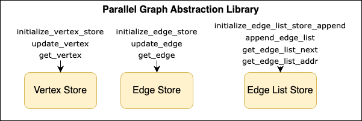
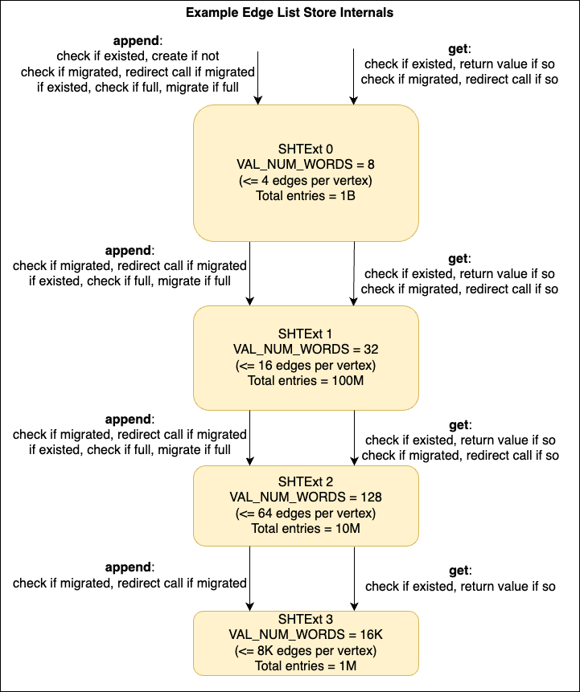
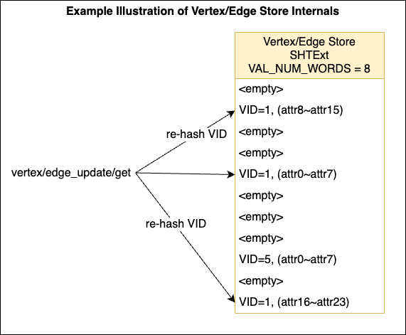

# Parallel Graph Abstraction (PGA)

## High Level Design

Parallel Graph Abstraction (PGA) is a library to abstract graph store and computation for the highly paralleled UpDown architecture.

The PGA is built upon a extended version of Scalable Hash Table (SHTExt), which enables the value part of the key-value pair to be a list (supports append, get with mask, get with offset).

The PGA consists 3 parts: Vertex Store, Edge Store, Neighbor List Store

- Vertex Store - a SHTExt instance mapping `<VID, (attr0, attr1, ...)>` for storing vertex attributes.
- Edge Store - a SHTExt instance mapping `<EID, (attr0, attr1, ...)>` for storing edge attributes.
- Edge List Store - chained SHTExt instances mapping `<VID, [(nb_vid0, nb_eid0), (nb_vid1, nb_eid1), ...]>` for storing neighbor list. The instances should be allocated with different value sizes to accomodate vertices with varying number of neighbors. When the smaller SHTExt is filled up, the list is migrated to the next size SHTExt, and the current smaller SHTExt is marked as migrated.

The PGA APIs generates one or more calls into SHTExt. There is no guarantee of atomicity for the PGA APIs. Only underlying SHTExt APIs provides atomicity guarantee. This means the SHTExt calls generated by multiple PGA API calls can be interleaved (i.e. executed out of order).







## APIs

#### `initialize_vertex_store`

``` c
  (uint64_t SHT_DESC_SIZE, uint64_t SHT_LANE_DESC_SIZE) initialize_vertex_store(
      uint32_t PGA_DESC_LM_OFFSET, uint32_t TMP_BUF_LM_OFFSET,
      uint32_t NUM_ALLOC_LANES, uint32_t START_NWID,
      uint32_t LANE_DESC_LM_OFFSET, uint32_t BUCKETS_PER_LANE,
      uint32_t ENTRIES_PER_BUCKET, uint32_t VAL_NUM_WORDS,
      uint64_t DRAM_ALLOC_ADDR
      );
```

  - Initialize the data structure (SHT Extended) for storing vertex attributes (each attribute is an 8-byte word)
  - Operand Words
    1. `PGA_DESC_LM_OFFSET[0:31] | TMP_BUF_LM_OFFSET [32:63]`
        - Bits `[0:31]`, Parallel Graph Abstraction descriptor LM offset
        - Bits `[32:63]`, 64 bytes temp LM buffer offset for preparing messages
    2. `NUM_ALLOC_LANES[0:31] | START_NWID[32:63]`
        - Bits `[0:31]`, number of allocated lanes
        - Bits `[32:63]`, start NWID of the allocated lanes (lanes are allocated consecutivly)
    3. `LANE_DESC_LM_OFFSET[0:31] | BUCKETS_PER_LANE[32:63]`
        - Bits `[0:31]`, (on each allocated UpDown lane) start LM offset for storing the SHT lane descriptor
        - Bits `[32:63]`, number of buckets per lane
    4. `ENTRIES_PER_BUCKET[0:31] | VAL_NUM_WORDS[32:63]`
        - Bits `[0:31]`, number of entries per bucket
        - Bits `[32:63]`, number of words for the value in each entry
    5. `DRAM_ALLOC_ADDR`
        - start DRAM address for the SHT Extended
  - Return Words
    1. `X8` - `SHT_DESC_SIZE`
    2. `X9` - `SHT_LANE_DESC_SIZE`

#### `initialize_edge_store`

``` c
  (uint64_t SHT_DESC_SIZE, uint64_t SHT_LANE_DESC_SIZE) initialize_edge_store(
      uint32_t PGA_DESC_LM_OFFSET, uint32_t TMP_BUF_LM_OFFSET,
      uint32_t NUM_ALLOC_LANES, uint32_t START_NWID,
      uint32_t LANE_DESC_LM_OFFSET, uint32_t BUCKETS_PER_LANE,
      uint32_t ENTRIES_PER_BUCKET, uint32_t VAL_NUM_WORDS,
      uint64_t DRAM_ALLOC_ADDR
      );
```

  - Initialize the data structure (SHT Extended) for storing edge attributes (each attribute is an 8-byte word)
  - Operand Words
    1. `PGA_DESC_LM_OFFSET[0:31] | TMP_BUF_LM_OFFSET [32:63]`
        - Bits `[0:31]`, Parallel Graph Abstraction descriptor LM offset
        - Bits `[32:63]`, 64 bytes temp LM buffer offset for preparing messages
    2. `NUM_ALLOC_LANES[0:31] | START_NWID[32:63]`
        - Bits `[0:31]`, number of allocated lanes
        - Bits `[32:63]`, start NWID of the allocated lanes (lanes are allocated consecutivly)
    3. `LANE_DESC_LM_OFFSET[0:31] | BUCKETS_PER_LANE[32:63]`
        - Bits `[0:31]`, (on each allocated UpDown lane) start LM offset for storing the SHT lane descriptor
        - Bits `[32:63]`, number of buckets per lane
    4. `ENTRIES_PER_BUCKET[0:31] | VAL_NUM_WORDS[32:63]`
        - Bits `[0:31]`, number of entries per bucket
        - Bits `[32:63]`, number of words for the value in each entry
    5. `DRAM_ALLOC_ADDR`
        - start DRAM address for the SHT Extended
  - Return Words
    1. `X8` - `SHT_DESC_SIZE`
    2. `X9` - `SHT_LANE_DESC_SIZE`

#### `initialize_edge_list_store_append`

``` c
  (uint64_t SHT_DESC_SIZE, uint64_t SHT_LANE_DESC_SIZE) initialize_edge_list_store_append(
      uint32_t PGA_DESC_LM_OFFSET, uint32_t TMP_BUF_LM_OFFSET,
      uint32_t NUM_ALLOC_LANES, uint32_t START_NWID,
      uint32_t LANE_DESC_LM_OFFSET, uint32_t BUCKETS_PER_LANE,
      uint32_t ENTRIES_PER_BUCKET, uint32_t VAL_NUM_WORDS,
      uint64_t DRAM_ALLOC_ADDR
      );
```

  - Add one more the data structure (SHT Extended) for storing neighbor list
    - This is intended to be called multiple times
    - **NOTE: it should be called to initialize from the largest `VAL_NUM_WORDS` SHTExt instance to the smallest**
    - **NOTE: currently, the largest `VAL_NUM_WORDS` SHTExt instance must gurantee it can fit the highest degree vertex**
  - Operand Words
    1. `PGA_DESC_LM_OFFSET[0:31] | TMP_BUF_LM_OFFSET [32:63]`
        - Bits `[0:31]`, Parallel Graph Abstraction descriptor LM offset
        - Bits `[32:63]`, 64 bytes temp LM buffer offset for preparing messages
    2. `NUM_ALLOC_LANES[0:31] | START_NWID[32:63]`
        - Bits `[0:31]`, number of allocated lanes
        - Bits `[32:63]`, start NWID of the allocated lanes (lanes are allocated consecutivly)
    3. `LANE_DESC_LM_OFFSET[0:31] | BUCKETS_PER_LANE[32:63]`
        - Bits `[0:31]`, (on each allocated UpDown lane) start LM offset for storing the SHT lane descriptor
        - Bits `[32:63]`, number of buckets per lane
    4. `ENTRIES_PER_BUCKET[0:31] | VAL_NUM_WORDS[32:63]`
        - Bits `[0:31]`, number of entries per bucket
        - Bits `[32:63]`, number of words for the value in each entry
    5. `DRAM_ALLOC_ADDR`
        - start DRAM address for the SHT Extended
  - Return Words
    1. `X8` - `SHT_DESC_SIZE`
    2. `X9` - `SHT_LANE_DESC_SIZE`

#### `update_vertex`

``` c
  (uint64_t VID, uint64_t MASK) update_vertex(
      uint32_t PGA_DESC_LM_OFFSET, uint32_t TMP_BUF_LM_OFFSET,
      uint64_t VID,
      uint64_t MASK,
      uint64_t VAL0,
      [optional] uint64_t VAL1,
      [optional] uint64_t VAL2,
      [optional] uint64_t VAL3,
      [optional] uint64_t VAL4,
      );
```

  - Update vertex attribute(s)
  - Operand Words
    1. `PGA_DESC_LM_OFFSET[0:31] | TMP_BUF_LM_OFFSET [32:63]`
        - Bits `[0:31]`, Parallel Graph Abstraction descriptor LM offset
        - Bits `[32:63]`, 64 bytes temp LM buffer offset for preparing messages
    2. `VID` - vertex ID
    3. `MASK` - up to 64 bits mask to select which attribute to update
    4. `VAL0` - value for updating the attributes
    5. `VAL1` - (optional) value for updating the attributes
    6. `VAL2` - (optional) value for updating the attributes
    7. `VAL3` - (optional) value for updating the attributes
    8. `VAL4` - (optional) value for updating the attributes
  - Return Words
    1. `X8` - `VID`
    2. `X9` - `MASK` - set to 0 if failed

#### `get_vertex`

``` c
  (uint64_t VID,
   uint64_t MASK,
   [optional] VAL0,
   [optional] VAL1,
   [optional] VAL2,
   [optional] VAL3,
   [optional] VAL4,
   [optional] VAL5)
  get_vertex(
      uint64_t PGA_DESC_LM_OFFSET,
      uint64_t VID,
      uint64_t MASK
  );
```

  - Get edge attribute(s)
  - Operands
    1. `PGA_DESC_LM_OFFSET[0:63]`
        - Parallel Graph Abstraction descriptor LM offset
    2. `VID` - vertex ID
    3. `MASK` - up to 64 bits mask to select which attribute to get
  - Returns
    1. `X8`  - `VID`
    2. `X9`  - `MASK` - set to 0 if failed
    3. `X10` - (optional) value word 0
    4. `X11` - (optional) value word 1
    5. `X12` - (optional) value word 2
    6. `X13` - (optional) value word 3
    7. `X14` - (optional) value word 4
    8. `X15` - (optional) value word 5

#### `update_edge`

``` c
  (uint64_t EID, uint64_t MASK) update_edge(
      uint32_t PGA_DESC_LM_OFFSET, uint32_t TMP_BUF_LM_OFFSET,
      uint64_t EID,
      uint64_t MASK,
      uint64_t VAL0,
      [optional] uint64_t VAL1,
      [optional] uint64_t VAL2,
      [optional] uint64_t VAL3,
      [optional] uint64_t VAL4,
      );
```

  - Update edge attribute(s)
  - Operands
    1. `PGA_DESC_LM_OFFSET[0:31] | TMP_BUF_LM_OFFSET [32:63]`
        - Bits `[0:31]`, Parallel Graph Abstraction descriptor LM offset
        - Bits `[32:63]`, 64 bytes temp LM buffer offset for preparing messages
    2. `EID` - Edge ID
    3. `MASK` - up to 64 bits mask to select which attribute to update
    4. `VAL0` - value for updating the attributes
    5. `VAL1` - (optional) value for updating the attributes
    6. `VAL2` - (optional) value for updating the attributes
    7. `VAL3` - (optional) value for updating the attributes
    8. `VAL4` - (optional) value for updating the attributes
  - Returns
    1. `X8`  - `EID`
    3. `X10` - `MASK` - set to 0 if failed

#### `get_edge`

``` c
  (uint64_t EID,
   uint64_t MASK,
   [optional] VAL0,
   [optional] VAL1,
   [optional] VAL2,
   [optional] VAL3,
   [optional] VAL4,
   [optional] VAL5)
  get_edge(
      uint64_t PGA_DESC_LM_OFFSET,
      uint64_t EID,
      uint64_t MASK
  );
```

  - Get edge attribute(s)
  - Operands
    1. `PGA_DESC_LM_OFFSET[0:63]`
        - Parallel Graph Abstraction descriptor LM offset
    2. `EID` - Edge ID
    3. `MASK` - up to 64 bits mask to select which attribute to get
  - Returns
    1. `X8`  - `EID`
    2. `X9`  - `MASK` - set to 0 if failed
    3. `X10` - (optional) value word 0
    4. `X11` - (optional) value word 1
    5. `X12` - (optional) value word 2
    6. `X13` - (optional) value word 3
    7. `X14` - (optional) value word 4
    8. `X15` - (optional) value word 5

#### `append_edge_list`

``` c
  (uint64_t SRC_VID, uint64_t NB_LIST_DRAM_ADDR) append_edge_list(
      uint32_t PGA_DESC_LM_OFFSET, uint32_t TMP_BUF_LM_OFFSET,
      uint64_t SRC_VID,
      uint64_t DST_VID0,
      uint64_t EID0,
      [optional] uint64_t DST_VID1,
      [optional] uint64_t EID1,
      [optional] uint64_t DST_VID2,
      [optional] uint64_t EID2
      );
```

  - Append edge to the edge list of a vertex
    - each edge is stored as a tuple (DST_VID, EID)
    - EID is assigned by the user upon insertion, it required to be unique
    - recommend EID = Hash(SRC_VID, DST_VID, random_num)
  - Operands
    1. `PGA_DESC_LM_OFFSET[0:31] | TMP_BUF_LM_OFFSET [32:63]`
        - Bits `[0:31]`, Parallel Graph Abstraction descriptor LM offset
        - Bits `[32:63]`, 64 bytes temp LM buffer offset for preparing messages
    2. `SRC_VID` - source vertex ID
    3. `DST_VID0` - destination VID to be appended
    4. `EID0` - EID to be appended
    5. `DST_VID1` - destination VID to be appended
    6. `EID1` - EID to be appended
    7. `DST_VID2` - destination VID to be appended
    8. `EID2` - EID to be appended
  - Returns
    1. `X8` - `VID`
    2. `X9` - `NB_LIST_DRAM_ADDR` - DRAM address for the edge list (first word is the number of words in the list), set to 0 if lookup failed

#### `get_edge_list_next`

``` c
  (uint64_t SRC_VID,
   uint64_t WORD_OFFSET,
   [optional] uint64_t DST_VID0,
   [optional] uint64_t EID0,
   [optional] uint64_t DST_VID1,
   [optional] uint64_t EID1,
   [optional] uint64_t DST_VID2,
   [optional] uint64_t EID2
   )
  get_edge_list_next(
      uint64_t PGA_DESC_LM_OFFSET,
      uint64_t SRC_VID,
      uint64_t WORD_OFFSET
  );
```

  - Get attched edges of a vertex
    - each edge is stored as a tuple (DST_VID, EID)
    - EID is assigned by the user upon insertion, it required to be unique
  - Operands
    1. `PGA_DESC_LM_OFFSET[0:63]`
        - Parallel Graph Abstraction descriptor LM offset
    2. `SRC_VID` - source vertex ID
    3. `WORD_OFFSET` - word offset into the edge list
  - Returns
    1. `X8`  - `SRC_VID`
    2. `X9`  - `WORD_OFFSET` - updated word offset for the next call
    3. `X10` - `DST_VID0` - destination VID 0
    4. `X11` - `EID0` - EID 0
    5. `X12` - `DST_VID1` - destination VID 1
    6. `X13` - `EID1` - EID 1
    7. `X14` - `DST_VID2` - destination VID 2
    8. `X15` - `EID2` - EID 2

#### `get_edge_list_addr`

``` c
  (uint64_t SRC_VID,
   uint64_t EL_ADDR,
   uint64_t EL_WORD_LEN
   )
  get_edge_list_next(
      uint64_t PGA_DESC_LM_OFFSET,
      uint64_t SRC_VID
  );
```

  - Get DRAM address & size of the edge list of a vertex
    - each edge is stored as a tuple (DST_VID, EID)
    - EID is assigned by the user upon insertion, it required to be unique
  - Operands
    1. `PGA_DESC_LM_OFFSET[0:63]`
        - Parallel Graph Abstraction descriptor LM offset
    2. `SRC_VID` - source vertex ID
  - Returns
    1. `X8`  - `SRC_VID`
    2. `X9`  - `EL_ADDR` - Edge list start address
    3. `X10` - `EL_WORD_LEN` - Edge list length in number of words (2 words per edge)

#### `get_iters_vertex_store`

``` c
  (NWID,
   NWID)
  get_iters_vertex_store(
      uint64_t PGA_DESC_LM_OFFSET,
      uint64_t ITER_DRAM_ADDR
  );
```

  - Write a list of iterators for the vertex store
  - Operands
    1. `PGA_DESC_LM_OFFSET[0:63]`
        - Parallel Graph Abstraction descriptor LM offset
    2. `ITER_DRAM_ADDR`
        - DRAM address to store the list of iterators
        - size in words = # of lane `*` # of buckets per lane `* 2`
  - Returns
    1. `X8` - NWID which executed the code
    2. `X9` - NWID whcih executed the code

#### `get_iters_edge_store`

``` c
  (NWID,
   NWID)
  get_iters_edge_store(
      uint64_t PGA_DESC_LM_OFFSET,
      uint64_t ITER_DRAM_ADDR
  );
```

  - Write a list of iterators for the edge store
  - Operands
    1. `PGA_DESC_LM_OFFSET[0:63]`
        - Parallel Graph Abstraction descriptor LM offset
    2. `ITER_DRAM_ADDR`
        - DRAM address to store the list of iterators
        - size in words = # of lane `*` # of buckets per lane `* 2`
  - Returns
    1. `X8` - NWID which executed the code
    2. `X9` - NWID whcih executed the code

#### `get_next_vertex_store_iter`

``` c
  (uint32_t LANE_DESC_LM_OFFSET,
   uint32_t BUCKET_DESC_LM_OFFSET,
   uint32_t NWID,
   uint32_t CUR_POSITION,
   [optional] VID,
   [optional] ATTR_ADDR,
   )
  get_next_vertex_store_iter(
      uint32_t PGA_DESC_LM_OFFSET, uint32_t TMP_BUF_LM_OFFSET,
      uint32_t NWID, uint32_t CUR_POSITION
  );
```

  - Iterate the next entry in the vertex store iterator
  - Operands (**these operand should be constructed by the `get_iters_vertex_store` instead of the user**)
    1. `LANE_DESC_LM_OFFSET[0:31] | BUCKET_DESC_LM_OFFSET[32:63]`
    2. `NWID[0:31] | CUR_POSITION[32:63]`
  - Returns (`X8` and `X9` should be used for the next call)
    1. `X8`- `LANE_DESC_LM_OFFSET[0:31] | BUCKET_DESC_LM_OFFSET[32:63]`
    2. `X9`- `NWID[0:31] | CUR_POSITION[32:63]` - `CUR_POSITION[0:31]` set to -1 if reached end, set to -2 if passed end
    3. `X10` - `VID` - omit if passed end, VID of the current entry
    4. `X11` - `ATTR_ADDR` -  omit if passed end, start DRAM address of the attributes corresponding to the `VID`

#### `get_next_edge_store_iter`

``` c
  (uint32_t LANE_DESC_LM_OFFSET,
   uint32_t BUCKET_DESC_LM_OFFSET,
   uint32_t NWID,
   uint32_t CUR_POSITION,
   [optional] VID,
   [optional] ATTR_ADDR,
   )
  get_next_edge_store_iter(
      uint32_t PGA_DESC_LM_OFFSET, uint32_t TMP_BUF_LM_OFFSET,
      uint32_t NWID, uint32_t CUR_POSITION
  );
```

  - Iterate the next entry in the edge store iterator
  - Operands (**these operand should be constructed by the `get_iters_edge_store` instead of the user**)
    1. `LANE_DESC_LM_OFFSET[0:31] | BUCKET_DESC_LM_OFFSET[32:63]`
    2. `NWID[0:31] | CUR_POSITION[32:63]`
  - Returns (`X8` and `X9` should be used for the next call)
    1. `X8`- `LANE_DESC_LM_OFFSET[0:31] | BUCKET_DESC_LM_OFFSET[32:63]`
    2. `X9`- `NWID[0:31] | CUR_POSITION[32:63]` - `CUR_POSITION[0:31]` set to -1 if reached end, set to -2 if passed end
    3. `X10` - `EID` - omit if passed end, EID of the current entry
    4. `X11` - `ATTR_ADDR` -  omit if passed end, start DRAM address of the attributes corresponding to the `EID`

#### `get_next_split_vertex_store_iter`

``` c
  (uint32_t LANE_DESC_LM_OFFSET,
   uint32_t BUCKET_DESC_LM_OFFSET,
   uint32_t NWID,
   uint32_t CUR_POSITION,
   )

   ([optional] VID,
    [optional] ATTR_ADDR,
   )

  get_next_split_vertex_store_iter(
      uint32_t PGA_DESC_LM_OFFSET, uint32_t TMP_BUF_LM_OFFSET,
      uint32_t NWID, uint32_t CUR_POSITION,
      uint64_t KEY_ADDR_CONT
  );
```

  - Iterate the next entry in the vertex store iterator
    - Split the next iterator & (KEY, ADDR) returns to increase parallism
  - Operands (**operand 1 & 2 should be constructed by the `get_iters_vertex_store` instead of the user**)
    1. `LANE_DESC_LM_OFFSET[0:31] | BUCKET_DESC_LM_OFFSET[32:63]`
    2. `NWID[0:31] | CUR_POSITION[32:63]`
    3. `KEY_ADDR_CONT` - continuation word for returning the (KEY, ADDR)
  - Returns (with default continuation, operands should be used for the next call):
    1. `X8`- `LANE_DESC_LM_OFFSET[0:31] | BUCKET_DESC_LM_OFFSET[32:63]`
    2. `X9`- `NWID[0:31] | CUR_POSITION[32:63]` - `CUR_POSITION[0:31]` set to -1 if reached end, set to -2 if passed end
  - Returns (with `KEY_ADDR_CONT`): - omit if passed end
    1. `X8` - `VID` - omit if passed end, VID of the current entry
    2. `X9` - `ATTR_ADDR` -  omit if passed end, start DRAM address of the attributes corresponding to the `VID`

#### `get_next_split_edge_store_iter`

``` c
  (uint32_t LANE_DESC_LM_OFFSET,
   uint32_t BUCKET_DESC_LM_OFFSET,
   uint32_t NWID,
   uint32_t CUR_POSITION,
   )

   ([optional] EID,
    [optional] ATTR_ADDR,
   )

  get_next_split_edge_store_iter(
      uint32_t PGA_DESC_LM_OFFSET, uint32_t TMP_BUF_LM_OFFSET,
      uint32_t NWID, uint32_t CUR_POSITION,
      uint64_t KEY_ADDR_CONT
  );
```

  - Iterate the next entry in the egde store iterator
    - Split the next iterator & (KEY, ADDR) returns to increase parallism
  - Operands (**operand 1 & 2 should be constructed by the `get_iters_edge_store` instead of the user**)
    1. `LANE_DESC_LM_OFFSET[0:31] | BUCKET_DESC_LM_OFFSET[32:63]`
    2. `NWID[0:31] | CUR_POSITION[32:63]`
    3. `KEY_ADDR_CONT` - continuation word for returning the (KEY, ADDR)
  - Returns (with default continuation, operands should be used for the next call):
    1. `X8`- `LANE_DESC_LM_OFFSET[0:31] | BUCKET_DESC_LM_OFFSET[32:63]`
    2. `X9`- `NWID[0:31] | CUR_POSITION[32:63]` - `CUR_POSITION[0:31]` set to -1 if reached end, set to -2 if passed end
  - Returns (with `KEY_ADDR_CONT`): - omit if passed end
    1. `X8` - `EID` - omit if passed end, EID of the current entry
    2. `X9` - `ATTR_ADDR` -  omit if passed end, start DRAM address of the attributes corresponding to the `EID`

## Source Files

PGA source files:

- `libraries/ParallelGraph/Abstraction/linkable/pga_call_macros.py` - PGA APIs call macros for writting assembly program
- `libraries/ParallelGraphAbstraction/linkable/pga.udwh` - PGA APIs header for writting UDWeave program
- `libraries/ParallelGraph/Abstraction/linkable/pga.py` - PGA library source

Other source files used by PGA:

- `libraries/ScalableHashTable/linkable/sht_ext.py` - SHTExt library source
- `libraries/ScalableHashTable/linkable/sht_ext_call_macros.py` - SHTExt APIs for writting assembly program
- `libraries/ScalableHashTable/linkable/sht_ext.udwh` - SHTExt APIs for writting UDWeave program
- `libraries/ScalableHashTable/linkable/sht_macros.py` - helper macros
- `libraries/ScalableHashTable/linkable/memcpy.py` - memcpy program (use for neighbor list store migration, but it is generic)
- `libraries/ScalableHashTable/linkable/memcpy.udwh` - memcpy APIs for writting UDWeave program

## Examples

- Check out `apps/pga_tests/linkable`

  - `apps/pga_tests/linkable/Makefile` - building executable EFA `pga_test_exe.py` and `pga_test_exe.hpp`
  - `apps/pga_tests/linkable/pga_test.py` - example assembly program of using PGA
  - `apps/pga_tests/linkable/pga_test.cpp` - example Top program of using PGA
  - `apps/pga_tests/linkable/pga_test_exe.hpp` - C++ header for the Top program to refer to transitions
  - `apps/pga_tests/linkable/pga_test_exe.py` - Linked executable EFA program
